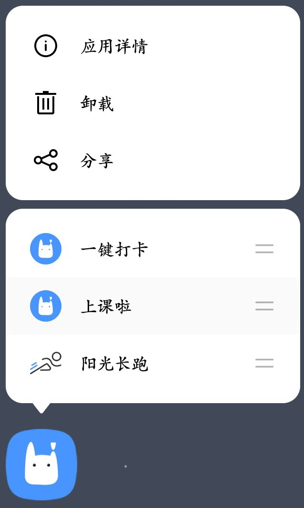
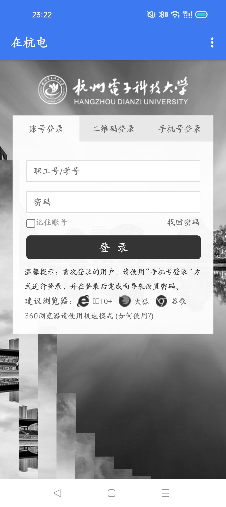
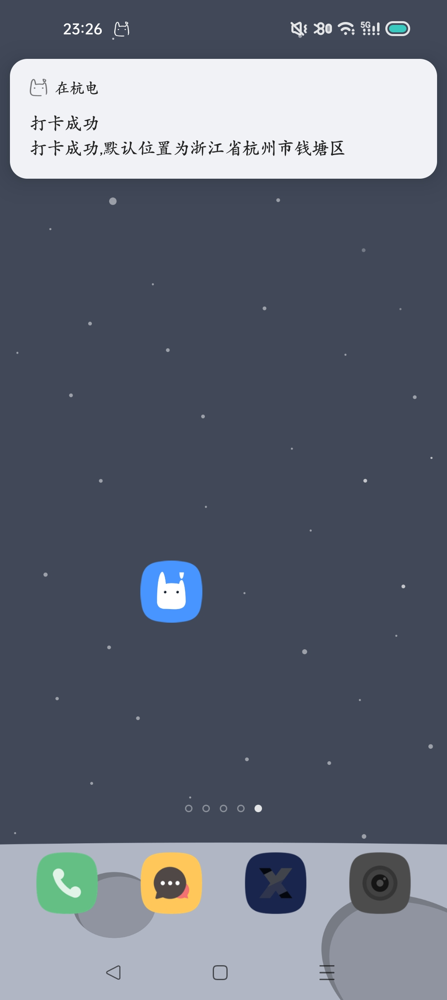
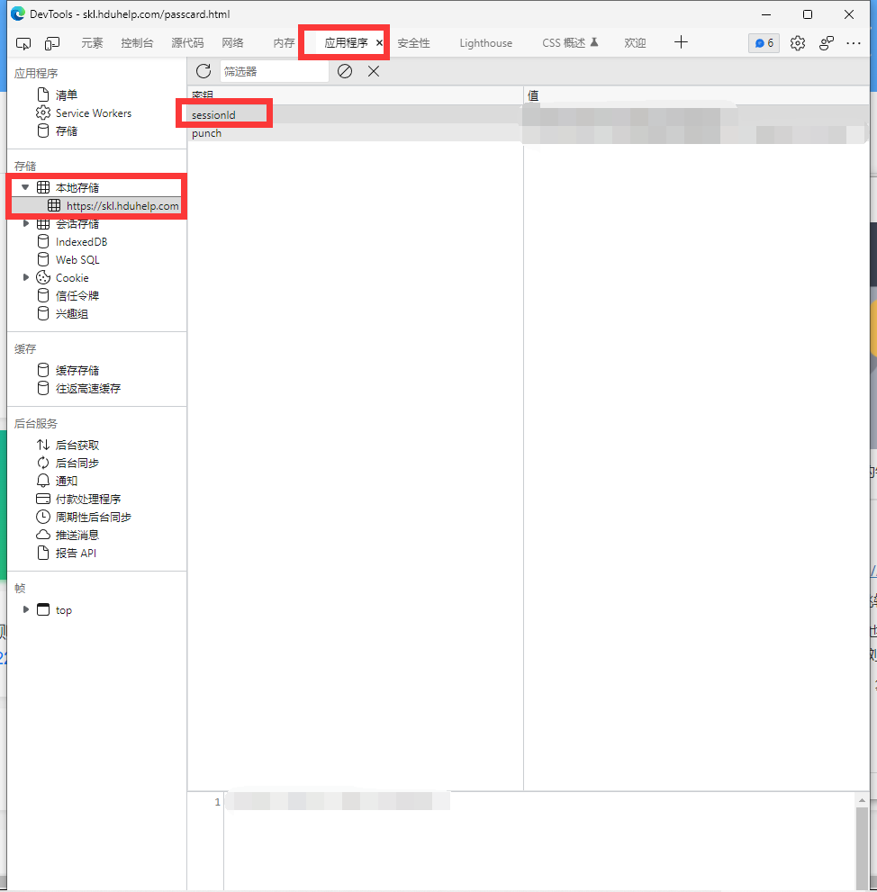
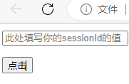

#  杭州电子科技大学每日健康打卡脚本
```
代码惯例：先结论，再细化。先实现，再分析
```

## 首先如何使用，分别有两个使用方法

------


### 第一种方法

- [下载app](hduin-release.apk)
- 在安卓手机上安装，无需打开它，而是长按app

  [^无需长按]: 那是因为我注册了快捷方式，更加便捷

  ，你将看到如下界面，对于非安卓手机，安卓手机api<25(*Android*7.1)的用户，请采用第二种方法

  [^为何采用第二种]: 那是因为过老的安卓不支持这个新功能

  



- 现在，请点击“一键打卡”功能，你将看到

  - 申请通知权限

    [^为何要通知权限]: 告诉你打卡成功，所以拒绝也是无妨的

    

  - 未登录跳转提示，一下是跳转结果

  - 现在请登录，再返回

    [^登录]: 这是杭电官网，我无法获取你的账号密码，但是打卡所需要的token是我必须获取的

    

- 再次长按app，点击一键打卡，你将发现，打卡成功！



- 此时你可以打开你的钉钉看看成功与否
------
### 第二种方法

- 打开，并登录https://skl.hduhelp.com/passcard.html#/passcard

  - 你将看到页面跳转，不用担心，这是正常的

- 登陆后按下"F12"，也即"开发者选项",这里我们以windows默认的egde为例子，其他浏览器请自行寻找

- 你将看到如下界面，复制sessionId的值，这很重要

  

-   [下载网页](index.html)

- 你会发现孤零零的两个东西

  

- 不要怀疑，填写，然后点击确认！之后看看你的钉钉，是不是已经打卡成功了？

------

## 超级碎碎念

以后再写